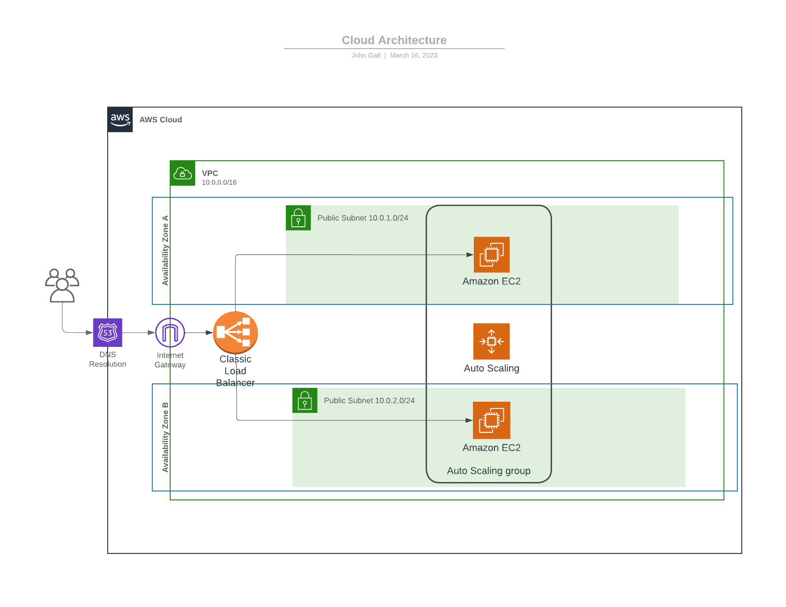

# Terraform Project: High Availability Web Server
This project demonstrates how to create a highly available web server environment on AWS using Terraform. It involves the use of several AWS services like Elastic Load Balancer (ELB), Auto Scaling, EC2 instances (Ubuntu), VPCs, and CloudWatch Alarms.

The project's goal is to have a resilient infrastructure that automatically scales according to the workload and remains available even if one or more instances become unavailable. CloudWatch Alarms are set up to monitor the instances.

The configuration code is given below along with instructions on how to use it.

## Overview of Infrastructure



Figure 1: This is a high-level architecture diagram showing how the services are deployed in AWS.

## Prerequisites
- Install Terraform (version 0.12.0 or newer)
- Install AWS CLI
- Configure AWS CLI by running aws configure

## Usage
To apply the Terraform configuration, you can follow these steps:

1. Initialize your Terraform workspace, which will download the provider and initialize it with the values provided in the terraform.tfvars file:
 `terraform init`

2. Preview the changes that will be made by the configuration file:
 `terraform plan`

3. Apply the changes:
 `terraform apply`

5. After confirming, Terraform will proceed to make the changes.

> Note: Always ensure you are in the directory that contains the .tf files when running the commands.

## Infrastructure Description

This section provides a detailed explanation of the Terraform code and how it works to provide the desired infrastructure.

#### AWS Provider
The AWS provider is used to interact with the many resources supported by AWS. The provider needs to be configured with the proper credentials before it can be used.
> Note: your may have to configure your credentials using aws_cli if not done so

#### VPC
A Virtual Private Cloud (VPC) is created with DNS support enabled to allow instances to interact with each other using hostnames.

#### Key Pair
An AWS key pair is created for secure SSH access to the instances. In this case I've generated one key pair to access the bastion instance, and the bastion instance has access to the ec2s.

#### Internet Gateway
An Internet Gateway is created and attached to the VPC to allow instances access to the internet.

#### Subnets
Public subnets are created in the VPC where the instances will be launched.

#### Route Tables
Route tables are created and associated with the subnets to allow network traffic to flow between subnets and the gateway.

#### Load Balancer
An Elastic Load Balancer (ELB) is created and associated with the public subnets. The load balancer distributes incoming traffic across multiple targets, such as EC2 instances, in multiple Availability Zones.

#### Launch Template
A Launch Template is created with the necessary details like the AMI ID, instance type, security group, and other details required for launching an instance. In this case i'm using a ubuntu image.
The launch template "user_data" attribute receives a file which has a set of instructions to run the web server.
In this case my file is at is follows:
 ```
#!/bin/bash
sudo apt-get update
sudo apt-get install -y curl
sudo curl -fsSL https://deb.nodesource.com/setup_14.x | sudo bash -
sudo apt-get install -y nodejs
sudo npm install -g yarn
git clone <YOUR REPO HERE>
cd <YOUR REPO NAME>
yarn
yarn build
sudo yarn start --port 80 
```

This set of instructions install the necessary tools for my web server code to run and for the instance to serve the code in the desired port.
> Note: You may have to change this script according to your web server needs.

#### Auto Scaling
An Auto Scaling Group (ASG) is created which uses the Launch Template to launch instances. The ASG makes sure that a specified number of instances are always running.

#### Security Group
Security Groups act as a virtual firewall for your instance to control inbound and outbound traffic.

#### ClouWatch Alarms Configuration
CloudWatch alarms are set to monitor the CPU utilization, network traffic, disk space utilization, memory utilization, and disk read/write operations. They are set to notify a specific Amazon SNS topic if the alarm state changes. 

Five different alarms are set up to monitor:

- CPU Utilization: An alarm is triggered if the CPU utilization is greater than or equal to 93% for two consecutive periods of 120 seconds.
- Inbound Network Traffic: An alarm is triggered if the inbound network traffic is greater than or equal to 1,000,000 bytes for two consecutive periods of 300 seconds.
- Outbound Network Traffic: An alarm is triggered if the outbound network traffic is greater than or equal to 1,000,000 bytes for two consecutive periods of 300 seconds.
- Disk Space Utilization: An alarm is triggered if the disk space utilization is greater than or equal to 90% for two consecutive periods of 300 seconds.
- Memory Utilization: An alarm is triggered if the memory utilization is greater than or equal to 90% for two consecutive periods of 300 seconds.
- Disk Read/Write Operations: An alarm is triggered if the disk read/write operations are greater than or equal to 100 for two consecutive periods of 300 seconds.

All alarms send notifications to a specific Amazon SNS topic when their state changes. This allows you to be informed about potential issues and take corrective actions if necessary.

### How to Run

1. You will need to have Terraform installed. If you do not have Terraform installed, you can download it [here](https://www.terraform.io/downloads.html).
2. Clone this repository: `git clone <repository-url>`
3. Change to the directory containing the Terraform files.
4. Run `terraform init` to initialize the working directory.
5. Run `terraform plan` to create an execution plan and see what changes will be made.
6. Run `terraform apply` to apply the changes.

> :warning: **Warning**: Be sure to check the changes and their impact on your resources and costs before running `terraform apply`.

## Cleanup

To destroy the resources created by this module, run `terraform destroy`. As always, be aware that this will destroy all resources created by the Terraform code, so use it carefully.

Please note that you will be charged for the usage of these AWS resources. To avoid unnecessary charges, be sure to clean up the resources after you're done experimenting.

## Conclusion

This project demonstrates how to use Terraform to provision a highly available and scalable web application infrastructure on AWS. This setup includes a VPC, subnets, security groups, EC2 instances, an Application Load Balancer, and CloudWatch alarms. All resources are configurable and are set with sensible defaults. 

Remember, infrastructure as code allows for rapid and reliable infrastructure deployments. However, you should always review and understand any scripts before deploying them into your environment. 

Moreover, before implementing this infrastructure in a production environment, you may need to make several enhancements. For example:

- Consider using HTTPS for secure communication: The Load Balancer is currently set up to use HTTP. For a production application, you would likely want to use HTTPS.

- Tune your CloudWatch Alarms: The thresholds and periods for the alarms have been set as an example. In a real-world application, these may need to be tuned based on the performance characteristics of your application.

- Consider the cost: The number of EC2 instances and their types can significantly affect your AWS bill. Be sure to review the resources and their associated costs before deploying this infrastructure.

I hope this example project is useful as a starting point for your own AWS infrastructure projects! Feel free to adapt and expand it to meet your specific needs.


